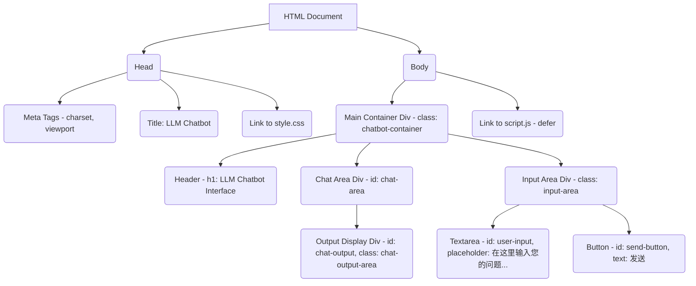

# LLM Chatbot Interface - 设计规划

## 1. 项目概述

本项目旨在创建一个简单的前端网页，用户可以通过该界面与大语言模型（LLM）进行交互。用户在输入框中输入文本，点击发送后，界面将（在未来对接API后）显示模型的回复。

**项目目录：** `llm-chatbot/`

## 2. 核心文件

*   `llm-chatbot/index.html`: 页面的主要HTML结构。
*   `llm-chatbot/style.css`: 页面的CSS样式。
*   `llm-chatbot/script.js`: 处理用户交互和未来API通信的JavaScript。

## 3. `index.html` 结构



**页面布局草图：**

```
+---------------------------------------------------+
|               LLM Chatbot Interface               | Header
+---------------------------------------------------+
|                                                   |
|                                                   |
|             [Chat Output Area]                    | Chat Area
|             (显示模型回复的地方)                  |
|                                                   |
|                                                   |
+---------------------------------------------------+
| [Textarea: 在这里输入您的问题...] [发送按钮]      | Input Area
+---------------------------------------------------+
```

## 4. `style.css` 基本样式考虑

*   **整体布局：**
    *   使用 Flexbox 或 Grid 来组织 `chatbot-container` 内的元素。
    *   `chat-output-area` 应该可以滚动，以容纳多条消息。
    *   `input-area` 固定在底部。
*   **元素样式：**
    *   为输入框、按钮和输出区域设置合适的边框、内边距、外边距。
    *   考虑基本的字体和颜色方案，保持简洁易读。
    *   用户输入和模型输出的消息可以有不同的背景色或对齐方式，以区分对话双方。
*   **响应式设计：**
    *   确保在不同屏幕尺寸下都能良好显示。

## 5. `script.js` 初期功能规划

*   **获取DOM元素：** 获取输入框、发送按钮、输出区域的引用。
*   **事件监听：**
    *   监听“发送”按钮的点击事件。
    *   （可选）监听输入框的回车键事件。
*   **处理用户输入：**
    *   当用户提交输入时：
        1.  获取输入文本。
        2.  在输出区显示用户输入。
        3.  清空输入框。
        4.  调用 `callLLMApi(userInputText)` 函数。
*   **API调用函数框架 `callLLMApi(prompt)`：**
    *   接收用户输入的 `prompt` 作为参数。
    *   **（占位逻辑）** 在函数内部，暂时不执行真实的API调用。
    *   可以包含 `try...catch` 结构来预处理未来可能发生的网络请求错误。
    *   在 `try` 块中，可以先 `console.log(\`准备调用API，输入内容: \${prompt}\`);`
    *   然后，模拟一个异步操作（例如使用 `setTimeout`），并在一段时间后，在聊天输出区显示一个模拟的模型回复。
        ```javascript
        // 示例：
        // const response = await fetch('/api/llm', { /* ...请求参数... */ });
        // const data = await response.json();
        // displayModelResponse(data.reply);
        setTimeout(() => {
            displayModelResponse("模型回复：这是来自模型的模拟异步答案。");
        }, 1000); // 模拟1秒的网络延迟
        ```
    *   在 `catch` 块中，处理错误，例如 `console.error("API调用失败:", error);` 并在聊天输出区显示错误信息。
*   **显示模型回复函数 `displayModelResponse(responseText)`：**
    *   一个辅助函数，用于将模型的回复（或模拟回复/错误信息）添加到 `chat-output-area`。

## 6. 后续步骤

1.  创建 `llm-chatbot/` 目录（如果尚不存在）。
2.  根据上述规划创建 `index.html`, `style.css`, 和 `script.js` 文件。
3.  逐步实现各个文件的内容。
4.  进行测试和调整。
5.  未来：根据确定的大模型API细节，完善 `callLLMApi` 函数，实现真实的API调用。