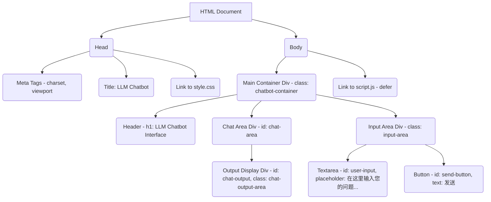

# LLM Chatbot Interface - 设计规划

## 1. 项目概述

本项目旨在创建一个简单的前端网页，用户可以通过该界面与大语言模型（LLM）进行交互。用户在输入框中输入文本，点击发送后，界面将（在未来对接API后）显示模型的回复。

**项目目录：** `llm-chatbot/`

## 2. 核心文件

*   `llm-chatbot/index.html`: 页面的主要HTML结构。
*   `llm-chatbot/style.css`: 页面的CSS样式。
*   `llm-chatbot/script.js`: 处理用户交互和未来API通信的JavaScript。

## 3. `index.html` 结构



**页面布局草图：**

```
+---------------------------------------------------+
|               LLM Chatbot Interface               | Header
+---------------------------------------------------+
|                                                   |
|                                                   |
|             [Chat Output Area]                    | Chat Area
|             (显示模型回复的地方)                  |
|                                                   |
|                                                   |
+---------------------------------------------------+
| [Textarea: 在这里输入您的问题...] [发送按钮]      | Input Area
+---------------------------------------------------+
```

## 4. `style.css` 基本样式考虑

*   **整体布局：**
    *   使用 Flexbox 或 Grid 来组织 `chatbot-container` 内的元素。
    *   `chat-output-area` 应该可以滚动，以容纳多条消息。
    *   `input-area` 固定在底部。
*   **元素样式：**
    *   为输入框、按钮和输出区域设置合适的边框、内边距、外边距。
    *   考虑基本的字体和颜色方案，保持简洁易读。
    *   用户输入和模型输出的消息可以有不同的背景色或对齐方式，以区分对话双方。
*   **响应式设计：**
    *   确保在不同屏幕尺寸下都能良好显示。

## 5. `script.js` 初期功能规划

*   **获取DOM元素：** 获取输入框、发送按钮、输出区域的引用。
*   **事件监听：**
    *   监听“发送”按钮的点击事件。
    *   （可选）监听输入框的回车键事件。
*   **处理用户输入：**
    *   当用户提交输入时：
        1.  获取输入文本。
        2.  在输出区显示用户输入。
        3.  清空输入框。
        4.  调用 `callLLMApi(userInputText)` 函数。
*   **API调用函数框架 `callLLMApi(prompt)`：**
    *   接收用户输入的 `prompt` 作为参数。
    *   **（占位逻辑）** 在函数内部，暂时不执行真实的API调用。
    *   可以包含 `try...catch` 结构来预处理未来可能发生的网络请求错误。
    *   在 `try` 块中，可以先 `console.log(\`准备调用API，输入内容: \${prompt}\`);`
    *   然后，模拟一个异步操作（例如使用 `setTimeout`），并在一段时间后，在聊天输出区显示一个模拟的模型回复。
        ```javascript
        // 示例：
        // const response = await fetch('/api/llm', { /* ...请求参数... */ });
        // const data = await response.json();
        // displayModelResponse(data.reply);
        setTimeout(() => {
            displayModelResponse("模型回复：这是来自模型的模拟异步答案。");
        }, 1000); // 模拟1秒的网络延迟
        ```
    *   在 `catch` 块中，处理错误，例如 `console.error("API调用失败:", error);` 并在聊天输出区显示错误信息。
*   **显示模型回复函数 `displayModelResponse(responseText)`：**
    *   一个辅助函数，用于将模型的回复（或模拟回复/错误信息）添加到 `chat-output-area`。

## 6. 特色功能

*   **API 配置管理:**
    *   允许用户保存、加载、新建和删除不同的 API 配置（提供商、基础 URL、密钥、模型）。
    *   支持下载当前配置（或空模板）为 JSON 文件。
    *   支持通过上传 JSON 配置文件快速填充设置表单（单个配置对象）或批量导入多个配置（包含配置对象数组的JSON文件）。
*   **连接方式选择:** 支持通过本地服务器代理（推荐，流式）或直接浏览器连接（有风险，非流式）与 LLM API 通信。
*   **文件上传:** 支持上传图片、文本文件（`.txt`, `.md`）以及 PDF (`.pdf`)、Word (`.docx`)、Excel (`.xlsx`) 文件。对于文本文件和 PDF 文件，会读取其内容；对于 Word/Excel，主要传递文件名给模型。
*   **对话历史管理:** 将对话（包括文本和图片/文件名）保存在前端，并在每次请求时发送给模型（限制长度）。
*   **HTML 预览:** 当模型回复包含 ```html ... ``` 代码块时，自动在消息下方显示一个“预览 HTML”按钮，点击可在模态窗口中渲染和查看该 HTML。
*   **发送按钮状态:** 发送消息时，按钮会显示“思考中...”并被禁用，直到收到回复。

## 7. 代码修改记录

*   **script.js:**
    *   添加了设置面板的显示/隐藏逻辑。
    *   实现了配置文件的本地存储（保存、加载、删除、新建）。
    *   新增了下载当前配置为模板 JSON 文件的功能。
    *   增强了通过上传 JSON 文件加载配置的功能，现在支持：
        *   上传包含单个配置对象的JSON文件以填充表单。
        *   上传包含配置对象数组的JSON文件以批量导入多个配置。
    *   重构了配置保存逻辑，使其更模块化。
    *   添加了连接方式（后端代理/直接连接）的选择和处理逻辑。
    *   扩展了文件上传功能，支持图片、文本文件 (`.txt`, `.md`) 和 PDF (`.pdf`) 文件（会解析内容），以及 Word (`.docx`)、Excel (`.xlsx`) 文件（主要传递文件名）。
    *   调整了文件预览逻辑以适应新文件类型。
    *   修改 `handleUserInput` 以包含附件数据（包括新文件类型的处理）。
    *   修改 `callLLMApi` 以支持发送包含图片或文件内容/文件名的消息历史，并处理流式（后端）和非流式（直接）响应。
    *   修复了在“直接浏览器连接”模式下，模型回复无法正确显示的问题（移除了不必要的 `removeThinkingMessage()` 调用）。
    *   添加了对话历史记录 (`conversationHistory`) 的存储和截断逻辑。
    *   优化了 `displayMessage` 函数处理模型回复的逻辑，确保文本内容和HTML预览按钮能稳定地呈现在界面上。
    *   修改 `displayMessage` 函数以检测模型回复中的 HTML 代码块 (```html...```)，并动态添加“预览 HTML”按钮。
    *   添加 `showHtmlPreview` 和 `closeHtmlPreview` 函数来控制 HTML 预览模态窗口的显示/隐藏和内容加载。
    *   添加 `escapeHtml` 辅助函数用于基本的内容安全处理（并修复了其中的语法错误）。
    *   在发送消息后，将发送按钮文本改为“思考中...”并禁用，在收到回复或出错后恢复。
    *   为动态创建的“预览 HTML”按钮显式设置了空ID，以增加代码清晰度，尽管事件绑定不依赖ID。
*   **index.html:**
    *   添加了设置按钮和设置面板的 HTML 结构。
    *   在配置文件管理区域添加了“下载模板”和“上传配置”按钮及对应的文件输入框。
    *   更新了文件上传输入框的 `accept` 属性以支持新的文件类型 (PDF, Word, Excel)。
    *   添加了连接方式的单选按钮。
    *   添加了文件上传按钮、隐藏的 input 和预览容器。
    *   添加了 HTML 预览模态窗口的结构。
    *   修改了 HTML 预览 iframe 的 `sandbox` 属性，移除了 `allow-same-origin`，仅保留 `allow-scripts`，以增强安全性，防止预览内容意外修改主页面。
*   **style.css:**
    *   添加了设置面板的样式。
    *   为新的“下载模板”和“上传配置”按钮添加了样式。
    *   添加了配置文件管理区域的样式。
    *   添加了状态消息的样式。
    *   添加了连接方式单选按钮组的样式。
    *   添加了文件预览（图片和文件名）的样式。
    *   添加了 HTML 预览模态窗口（遮罩、内容框、关闭按钮、iframe）的样式。
    *   添加了“预览 HTML”按钮的样式。
*   **server.js:**
    *   修改 `/api/chat` 端点以接收完整的 `messages` 数组（包含用户和助手的历史记录，以及可能的图片/文本内容），而不是单独的 `prompt` 和 `imageBase64`。
    *   根据请求体中的 `baseUrl` 动态创建 OpenAI 客户端实例。
    *   处理流式响应，将 `delta` 内容发送给前端。
    *   添加了 SSE 错误事件处理。
*   **README.md:**
    *   更新了项目概述和功能规划。
    *   添加了特色功能列表。
    *   添加了详细的代码修改记录。
    *   调整了章节顺序和编号。

## 8. 后续步骤

1.  创建 `llm-chatbot/` 目录（如果尚不存在）。
2.  根据上述规划创建 `index.html`, `style.css`, 和 `script.js` 文件。
3.  逐步实现各个文件的内容。
4.  进行测试和调整。
5.  未来：根据确定的大模型API细节，完善 `callLLMApi` 函数，实现真实的API调用。